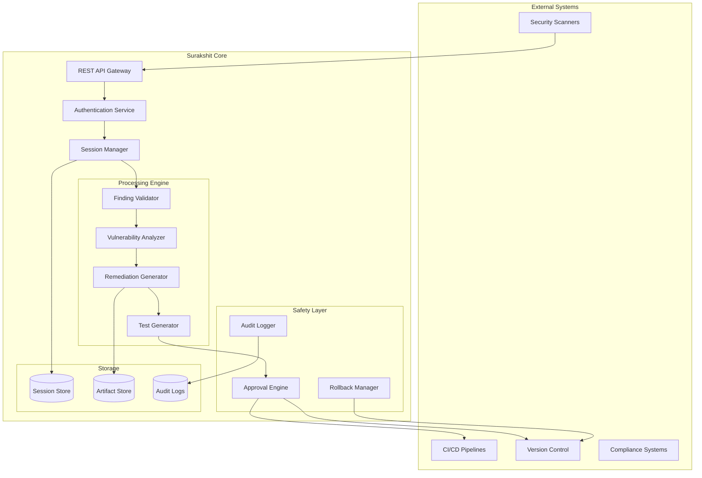

# Surakshit AI Agent Design Document

## Overview

Surakshit is designed as a microservices-based AI agent system that processes security findings and generates remediation-as-code. The architecture follows a plugin-based approach with clear separation of concerns, ensuring scalability, maintainability, and security. The system operates on an event-driven model with strict human-in-the-loop controls and comprehensive audit trails.

## Architecture

### High-Level Architecture



### Component Architecture

The system follows a layered architecture with the following tiers:

1. **API Layer**: RESTful interface for external integrations
2. **Business Logic Layer**: Core processing and decision-making components
3. **Safety Layer**: Human approval and rollback mechanisms
4. **Data Layer**: Persistent storage for sessions, artifacts, and audit logs

## Components and Interfaces

### 1. API Gateway

**Purpose**: Central entry point for all Surakshit operations

**Interfaces**:
```typescript
interface SurakshitAPI {
  // Core operations
  POST /findings: ProcessFindingRequest -> ProcessFindingResponse
  GET /sessions/{sessionId}: void -> SessionDetails
  POST /execute: ExecuteRequest -> ExecuteResponse
  
  // Management operations
  GET /health: void -> HealthStatus
  GET /audit/{sessionId}: void -> AuditTrail
  POST /rollback: RollbackRequest -> RollbackResponse
}
```

**Key Features**:
- Rate limiting and request validation
- Authentication and authorization
- Request/response logging
- Error handling and circuit breakers

### 2. Finding Validator

**Purpose**: Validates and normalizes incoming security findings

**Interface**:
```typescript
interface FindingValidator {
  validate(finding: RawFinding): ValidationResult
  normalize(finding: RawFinding): NormalizedFinding
  extractMetadata(finding: NormalizedFinding): FindingMetadata
}
```

**Validation Rules**:
- Required fields: finding_id, evidence, repo/branch
- Evidence format validation
- Repository access verification
- Duplicate detection within session

### 3. Vulnerability Analyzer

**Purpose**: Analyzes security findings and determines remediation approaches

**Interface**:
```typescript
interface VulnerabilityAnalyzer {
  analyze(finding: NormalizedFinding): AnalysisResult
  categorize(finding: NormalizedFinding): VulnerabilityCategory
  assessRisk(finding: NormalizedFinding): RiskAssessment
  mapCompliance(finding: NormalizedFinding): ComplianceMapping[]
}
```

**Analysis Capabilities**:
- OWASP Top 10 categorization
- CWE (Common Weakness Enumeration) mapping
- CVSS scoring integration
- Technology stack detection

### 4. Remediation Generator

**Purpose**: Generates multiple remediation strategies with code patches

**Interface**:
```typescript
interface RemediationGenerator {
  generateStrategies(analysis: AnalysisResult): RemediationStrategy[]
  createPatch(strategy: RemediationStrategy): UnifiedDiff
  generateRollback(patch: UnifiedDiff): UnifiedDiff
  validatePatch(patch: UnifiedDiff, context: CodeContext): ValidationResult
}
```

**Strategy Types**:
- **Quick Patch**: Minimal changes for immediate risk reduction
- **Full Fix**: Comprehensive solution addressing root cause
- **Long-term Hardening**: Architectural improvements for prevention

### 5. Test Generator

**Purpose**: Creates comprehensive test suites for remediation validation

**Interface**:
```typescript
interface TestGenerator {
  generateUnitTests(patch: UnifiedDiff, context: CodeContext): TestSuite
  generateIntegrationTests(strategy: RemediationStrategy): TestSuite
  generateSmokeTests(finding: NormalizedFinding): TestSuite
  generateSecurityTests(vulnerability: VulnerabilityCategory): TestSuite
}
```

**Test Categories**:
- **Unit Tests**: Validate individual function/method fixes
- **Integration Tests**: Ensure system-wide compatibility
- **Smoke Tests**: Basic functionality verification
- **Security Tests**: Vulnerability-specific validation

### 6. Approval Engine

**Purpose**: Manages human-in-the-loop approval workflows

**Interface**:
```typescript
interface ApprovalEngine {
  requireApproval(session: Session, action: ExecuteAction): ApprovalRequest
  validateToken(token: ApprovalToken): TokenValidation
  executeWithApproval(request: ExecuteRequest): ExecuteResponse
  revokeApproval(sessionId: string): void
}
```

**Security Features**:
- Time-limited approval tokens
- Multi-factor authentication support
- Role-based access control
- Approval audit trails

### 7. Session Manager

**Purpose**: Manages session lifecycle and state

**Interface**:
```typescript
interface SessionManager {
  createSession(finding: NormalizedFinding): Session
  getSession(sessionId: string): Session
  updateSession(sessionId: string, update: SessionUpdate): Session
  expireSession(sessionId: string): void
}
```

## Data Models

### Core Data Structures

```typescript
// Input Models
interface RawFinding {
  finding_id: string
  evidence: Evidence
  repo: string
  branch: string
  metadata?: Record<string, any>
}

interface Evidence {
  file_path: string
  line_number?: number
  code_snippet: string
  vulnerability_type: string
  severity: 'LOW' | 'MEDIUM' | 'HIGH' | 'CRITICAL'
  description: string
}

// Processing Models
interface NormalizedFinding extends RawFinding {
  session_id: string
  created_at: string
  normalized_evidence: NormalizedEvidence
}

interface AnalysisResult {
  vulnerability_category: VulnerabilityCategory
  risk_assessment: RiskAssessment
  compliance_mappings: ComplianceMapping[]
  technology_context: TechnologyContext
}

interface RemediationStrategy {
  id: string
  type: 'QUICK_PATCH' | 'FULL_FIX' | 'LONG_TERM_HARDENING'
  priority: number
  description: string
  rationale: string
  estimated_effort: string
  security_impact: string
  patch: UnifiedDiff
  rollback: UnifiedDiff
  tests: TestSuite[]
  ci_changes?: CIChanges
}

// Output Models
interface SurakshitResponse {
  session_id: string
  finding_id: string
  strategies: RemediationStrategy[]
  patch: UnifiedDiff
  rollback: UnifiedDiff
  tests: TestSuite[]
  ci_changes?: CIChanges
  compliance: ComplianceMapping[]
  rationale: string
  logs_ulid: string
}
```

### Database Schema

```sql
-- Sessions table
CREATE TABLE sessions (
  id UUID PRIMARY KEY,
  finding_id VARCHAR(255) NOT NULL,
  status VARCHAR(50) NOT NULL,
  created_at TIMESTAMP NOT NULL,
  updated_at TIMESTAMP NOT NULL,
  expires_at TIMESTAMP NOT NULL,
  metadata JSONB
);

-- Artifacts table
CREATE TABLE artifacts (
  id UUID PRIMARY KEY,
  session_id UUID REFERENCES sessions(id),
  artifact_type VARCHAR(100) NOT NULL,
  content TEXT NOT NULL,
  checksum VARCHAR(64) NOT NULL,
  created_at TIMESTAMP NOT NULL
);

-- Audit logs table
CREATE TABLE audit_logs (
  ulid VARCHAR(26) PRIMARY KEY,
  session_id UUID REFERENCES sessions(id),
  action VARCHAR(100) NOT NULL,
  actor VARCHAR(255) NOT NULL,
  details JSONB NOT NULL,
  timestamp TIMESTAMP NOT NULL
);
```

## Error Handling

### Error Categories

1. **Validation Errors**: Invalid input format or missing required fields
2. **Processing Errors**: Failures in analysis or remediation generation
3. **Security Errors**: Authentication, authorization, or approval failures
4. **System Errors**: Infrastructure or dependency failures

### Error Response Format

```typescript
interface ErrorResponse {
  error: {
    code: string
    message: string
    details?: Record<string, any>
    session_id?: string
    timestamp: string
  }
}
```

### Retry and Recovery

- **Transient Failures**: Automatic retry with exponential backoff
- **Validation Failures**: Immediate failure with detailed error messages
- **System Failures**: Circuit breaker pattern with graceful degradation
- **Security Failures**: Immediate termination with audit logging

## Testing Strategy

### Unit Testing

- **Component Isolation**: Each component tested independently with mocks
- **Business Logic**: Comprehensive coverage of remediation generation logic
- **Edge Cases**: Invalid inputs, boundary conditions, error scenarios
- **Security**: Authentication, authorization, and approval workflows

### Integration Testing

- **API Endpoints**: Full request/response cycle testing
- **Database Operations**: CRUD operations and transaction handling
- **External Integrations**: VCS and CI/CD system interactions
- **End-to-End Workflows**: Complete finding-to-PR workflows

### Security Testing

- **Input Validation**: SQL injection, XSS, and other injection attacks
- **Authentication**: Token validation and session management
- **Authorization**: Role-based access control verification
- **Audit Trails**: Logging completeness and integrity

### Performance Testing

- **Load Testing**: Concurrent request handling
- **Stress Testing**: System behavior under extreme load
- **Memory Testing**: Memory leak detection and resource usage
- **Latency Testing**: Response time optimization

## Security Considerations

### Authentication and Authorization

- **API Keys**: Secure API key management with rotation
- **JWT Tokens**: Short-lived tokens with refresh mechanisms
- **Role-Based Access**: Granular permissions for different user types
- **Multi-Factor Authentication**: Optional MFA for sensitive operations

### Data Protection

- **Encryption at Rest**: All sensitive data encrypted in storage
- **Encryption in Transit**: TLS 1.3 for all communications
- **Data Minimization**: Only store necessary information
- **Data Retention**: Automatic cleanup of expired sessions

### Secure Development

- **Input Sanitization**: All inputs validated and sanitized
- **Output Encoding**: Prevent injection attacks in generated code
- **Dependency Management**: Regular security updates and vulnerability scanning
- **Code Review**: Mandatory security review for all changes

## Deployment Architecture

### Container Strategy

```dockerfile
# Multi-stage build for security and efficiency
FROM node:18-alpine AS builder
WORKDIR /app
COPY package*.json ./
RUN npm ci --only=production

FROM node:18-alpine AS runtime
RUN addgroup -g 1001 -S surakshit && \
    adduser -S surakshit -u 1001
WORKDIR /app
COPY --from=builder /app/node_modules ./node_modules
COPY --chown=surakshit:surakshit . .
USER surakshit
EXPOSE 3000
CMD ["npm", "start"]
```

### Kubernetes Deployment

- **Horizontal Pod Autoscaling**: Scale based on CPU and memory usage
- **Resource Limits**: Prevent resource exhaustion
- **Health Checks**: Liveness and readiness probes
- **Secret Management**: Kubernetes secrets for sensitive configuration

### Monitoring and Observability

- **Metrics**: Prometheus metrics for performance monitoring
- **Logging**: Structured logging with correlation IDs
- **Tracing**: Distributed tracing for request flow analysis
- **Alerting**: Automated alerts for system health and security events